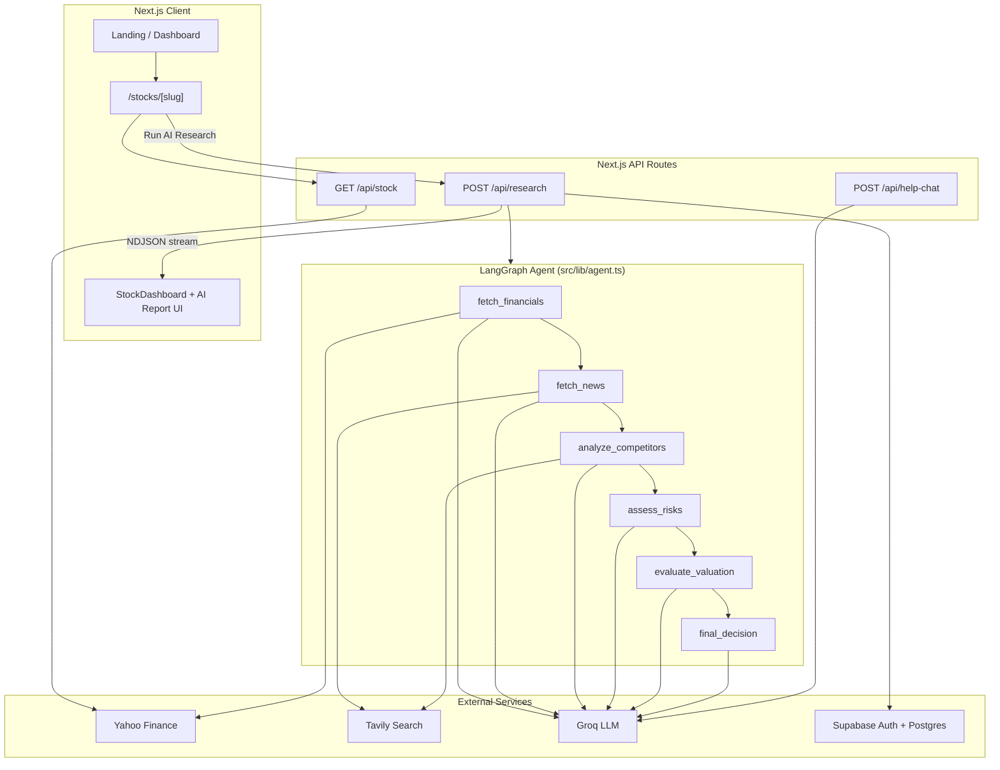

# MarketMind — AI Investment Research Agent

**InsideIIM × Altuni AI Labs Assignment Submission**

MarketMind is a multi-agent investment research console that analyzes any public company across five dimensions—financials, news sentiment, competitive position, risk, and valuation—and synthesizes a structured **BUY / HOLD / PASS** recommendation with explainable confidence scoring.

**Live demo:** [https://marketmind-ai.vercel.app](https://marketmind-ai.vercel.app) *(update this URL after deploying to your Vercel project)*

---

## 1. Overview

MarketMind helps retail and early-stage investors research stocks without reading dozens of filings and news articles manually. A user searches for a company (e.g., NVIDIA, Zomato, PC Jeweller), views a Groww-inspired stock page with live market data, and optionally runs a deep AI research pass that streams results node-by-node.

**What the agent produces:**

| Output | Description |
|--------|-------------|
| **Verdict** | `BUY`, `HOLD`, or `PASS` |
| **Confidence** | 10–99%, computed deterministically from weighted sub-scores |
| **Financial health** | Revenue growth, P/E, market cap, cash flow, debt, profitability |
| **News sentiment** | Positive/negative/neutral with key events and investment impact |
| **Competitor analysis** | Market position, strengths/weaknesses, named peers |
| **Risk matrix** | Categorized risks with severity levels |
| **Valuation** | Undervalued / Fairly Valued / Overvalued assessment |
| **Earnings & analyst data** | EPS surprise history and analyst recommendation breakdown |

**Key differentiators:**

- **Real data first** — Yahoo Finance for fundamentals; Tavily for news and competitor search (not hallucinated figures)
- **Multi-node LangGraph pipeline** — each analysis dimension is a separate reasoning step, not one monolithic prompt
- **Explainable confidence** — weighted formula, not an LLM-invented percentage
- **Streaming UX** — users see each agent node complete in real time
- **Groww-style stock pages** — instant `/stocks/[slug]` pages with charts and fundamentals; AI research is optional

> **Disclaimer:** MarketMind is an AI research assistant, not licensed financial advice. Always consult a qualified advisor before investing.

---

## 2. How to Run It

### Prerequisites

- **Node.js** 20+
- **npm** (or pnpm/yarn)
- API keys for **Groq**, **Tavily**, and **Supabase**

### Setup

```bash
# Clone the repository
git clone https://github.com/prince-up/MarketMind-AI.git
cd MarketMind-AI

# Install dependencies
npm install

# Copy environment template and fill in your keys
cp .env.example .env.local
```

### Environment Variables

| Variable | Required | Description |
|----------|----------|-------------|
| `GROQ_API_KEY` | Yes | Groq API key for Llama 3.3 70B (agent + help chat) |
| `TAVILY_API_KEY` | Yes | Tavily API key for news and competitor web search |
| `NEXT_PUBLIC_SUPABASE_URL` | Yes | Supabase project URL |
| `NEXT_PUBLIC_SUPABASE_ANON_KEY` | Yes | Supabase anonymous/public key |

See [`.env.example`](.env.example) for the full template.

### Supabase Setup

1. Create a Supabase project at [supabase.com](https://supabase.com).
2. Run the SQL in [`supabase_schema.sql`](supabase_schema.sql) in the Supabase SQL editor to create the `profiles` table (credits + tier) and signup trigger.
3. Enable Email auth (or your preferred provider) under Authentication → Providers.

### Run Locally

```bash
# Development server (http://localhost:3000)
npm run dev

# Production build
npm run build
npm start
```

### Usage Flow

1. Visit `/` for the marketing landing page, or `/dashboard` after signing in.
2. Search a company — you are routed to `/stocks/[slug]` (e.g. `/stocks/nvidia`, `/stocks/pc-jeweller-ltd`).
3. View live price, chart, and fundamentals instantly via `/api/stock`.
4. Click **Run AI Research** to trigger the LangGraph agent (requires login; consumes 1 credit).
5. Watch nodes stream: `fetch_financials` → `fetch_news` → `analyze_competitors` → `assess_risks` → `evaluate_valuation` → `final_decision`.

### Deploy to Vercel (Bonus)

1. Push the repo to GitHub.
2. Import the project in [Vercel](https://vercel.com/new).
3. Add all environment variables from `.env.example` in Project Settings → Environment Variables.
4. Deploy. Update the live URL at the top of this README.

---

## 3. How It Works

### Architecture

MarketMind uses a **sequential LangGraph.js StateGraph** where each node fetches or analyzes one dimension, accumulates state, and feeds the next node. The final node synthesizes a recommendation; confidence is calculated in code, not by the LLM.



### Agent Pipeline

| Node | Data Source | LLM Task |
|------|-------------|----------|
| `fetch_financials` | Yahoo Finance (`quote`, `quoteSummary`) | Structured financial health assessment + score |
| `fetch_news` | Tavily web search | Sentiment, key events, investment impact |
| `analyze_competitors` | Tavily web search | Market position, peer comparison, competitive score |
| `assess_risks` | Prior node outputs | Risk categories, severity, risk score |
| `evaluate_valuation` | Prior node outputs | Undervalued/Fair/Overvalued verdict + score |
| `final_decision` | All accumulated state | BUY/HOLD/PASS, reasoning, summary |

Each node uses **Zod schemas** with Groq structured output. Numeric scores are coerced in TypeScript after the LLM returns (to avoid JSON Schema transform issues).

### Confidence Formula

Confidence is computed deterministically in `final_decision`:

```
confidence = (financialScore × 0.30)
           + (newsSentimentScore × 0.20)
           + ((100 − riskScore) × 0.20)
           + (valuationScore × 0.20)
           + (competitorScore × 0.10)
```

Clamped to **10–99**. News sentiment maps to: positive = 80, neutral = 50, negative = 20.

### API Streaming

`POST /api/research` returns **newline-delimited JSON** events:

- `{ type: "node_complete", node: "fetch_financials", data: {...} }` — per-node updates
- `{ type: "complete", result: ResearchResult }` — final payload
- `{ type: "error", error: "..." }` — on failure

Auth is enforced via Supabase; each successful run deducts 1 credit from the user's `profiles` row.

### Tech Stack

| Layer | Technology |
|-------|------------|
| Framework | **Next.js 16** (App Router, React 19) |
| Runtime | **Node.js** |
| Agent orchestration | **LangGraph.js** |
| LLM | **Groq** — Llama 3.3 70B Versatile |
| Web search | **Tavily** |
| Market data | **Yahoo Finance** (`yahoo-finance2`) |
| Auth & credits | **Supabase** (Postgres + Auth) |
| Styling | Tailwind CSS 4 |
| Charts | Recharts |
| Validation | Zod 4 |

---

## 4. Key Decisions & Trade-offs

| Decision | Rationale | Trade-off |
|----------|-----------|-----------|
| **Sequential graph vs. parallel** | Simpler state management; risk/valuation nodes need prior outputs | Slower than parallel fetch (~30–60s total) |
| **Groq over Gemini** | Gemini free tier hit persistent 429 quota limits during development | Groq model may differ in reasoning quality vs. Gemini Pro |
| **Yahoo Finance for fundamentals** | Free, no API key, works for US and many Indian tickers (`.NS`) | Limited Indian-specific fields (circuits, shareholding); occasional ticker resolution failures |
| **Tavily for news/competitors** | Easy LangChain integration, good for recent web content | Search quality varies; not a substitute for paid news APIs |
| **Deterministic confidence** | Prevents LLM from inventing arbitrary confidence percentages | Formula weights are fixed; not personalized to user risk tolerance |
| **Structured output via Zod** | Reliable JSON parsing for UI rendering | Groq JSON Schema cannot represent Zod transforms; coercion done post-LLM |
| **Groww-style stock pages** | Instant UX for browsing; AI research is opt-in | Two data paths to maintain (`/api/stock` + agent) |
| **Credit-gated research** | Demonstrates auth + Postgres integration; limits API cost abuse | Adds signup friction for AI features |
| **Fallback data on node failure** | UI never crashes on partial failures | Scores may default to 50 when data is unavailable |

---

## 5. Example Runs

Structured example outputs for NVIDIA, Zomato (Eternal Ltd), and PC Jeweller are documented in **[`docs/EXAMPLE_RUNS.md`](docs/EXAMPLE_RUNS.md)**.

Quick summary:

| Company | Verdict | Confidence | Highlights |
|---------|---------|------------|------------|
| NVIDIA | BUY | 78% | Strong financials, AI leadership, elevated valuation risk |
| Zomato (Eternal) | HOLD | 62% | Food delivery growth, competition from Swiggy, path to profitability |
| PC Jeweller | PASS | 41% | Weak fundamentals, high risk, limited competitive moat |

---

## 6. What I Would Improve With More Time

1. **Parallel data fetching** — Run `fetch_financials`, `fetch_news`, and `analyze_competitors` concurrently to cut latency by ~40%.
2. **Indian market depth** — Integrate NSE/BSE APIs for circuits, shareholding patterns, and promoter holdings.
3. **Research history** — Persist past runs in Supabase so users can compare analyses over time.
4. **PDF export polish** — Improve report PDF layout with charts and source citations.
5. **Caching layer** — Redis or Vercel KV to cache Yahoo/Tavily responses for popular tickers.
6. **Evaluation suite** — Golden-test cases with expected score ranges to catch LLM drift.
7. **RAG over filings** — Ingest 10-K/annual reports for deeper fundamental analysis.
8. **Portfolio view** — Track multiple holdings and aggregate risk exposure.

---

## Project Structure

```
src/
├── app/
│   ├── api/
│   │   ├── research/route.ts    # LangGraph streaming endpoint
│   │   ├── stock/route.ts       # Yahoo Finance stock data
│   │   └── help-chat/route.ts   # Methodology assistant
│   ├── dashboard/page.tsx       # Authenticated research hub
│   ├── stocks/[slug]/page.tsx   # Groww-style stock pages
│   └── page.tsx                 # Marketing landing page
├── components/                  # UI (StockDashboard, VerdictCard, etc.)
├── lib/
│   ├── agent.ts                 # LangGraph StateGraph definition
│   └── supabase/                # Auth clients
└── types/index.ts               # ResearchResult and sub-type schemas
docs/
├── BUILD_LOG.md                 # AI-assisted development log
└── EXAMPLE_RUNS.md              # Sample agent outputs
```

---

## AI Development Documentation

This project was built with AI-assisted development (Cursor IDE). An honest build log summarizing the iterative process is in **[`docs/BUILD_LOG.md`](docs/BUILD_LOG.md)**.

To include full Cursor chat transcripts in your submission zip, export them from Cursor and place them in the `docs/` folder.

---

## License

See [LICENSE](LICENSE).
